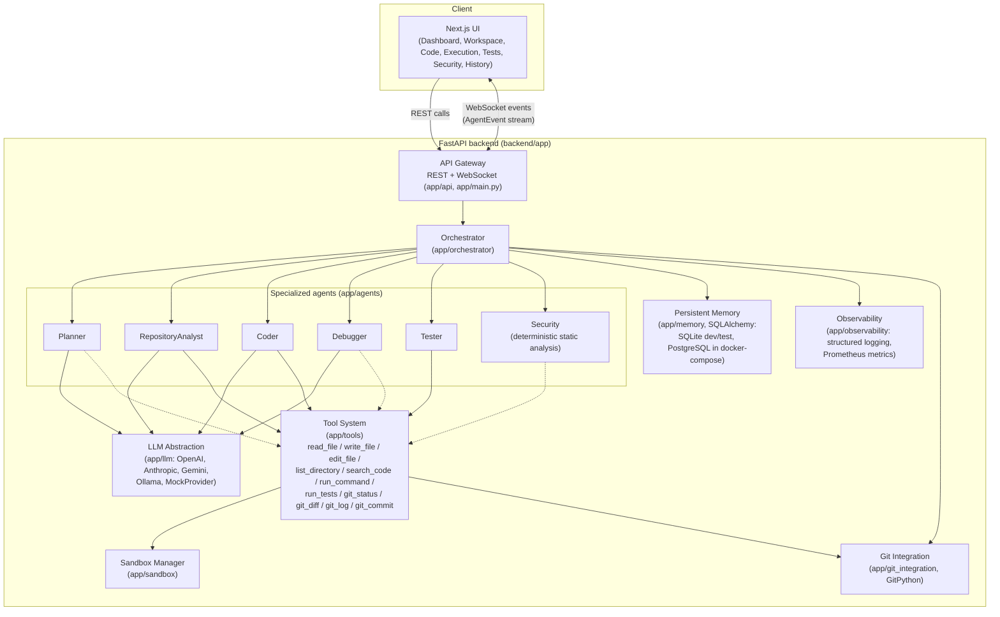
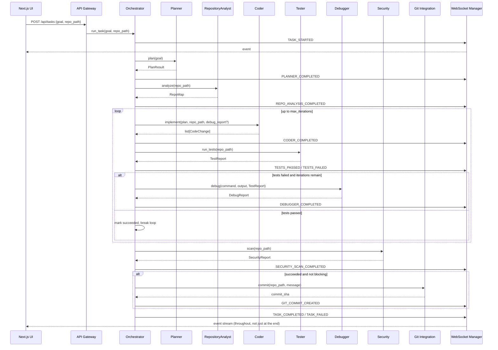
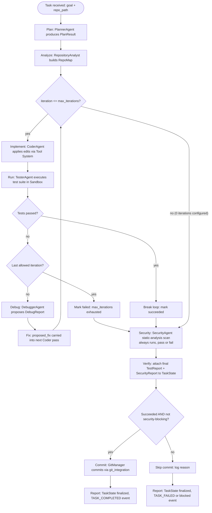
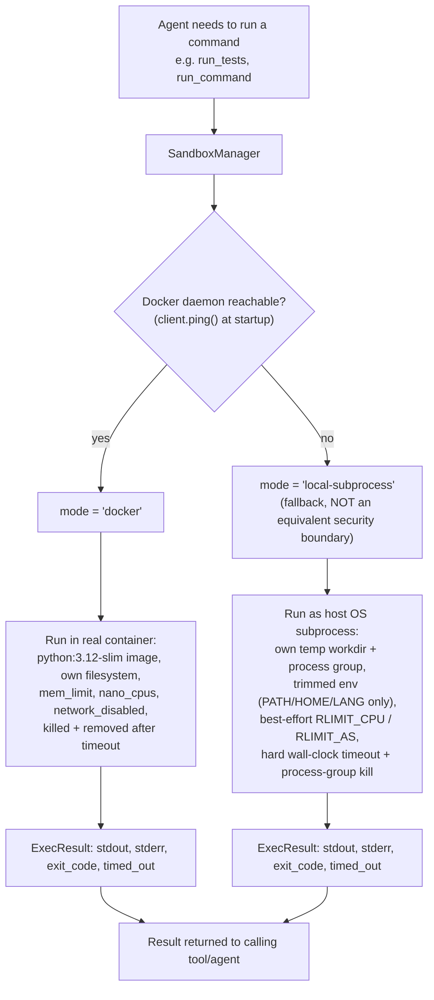
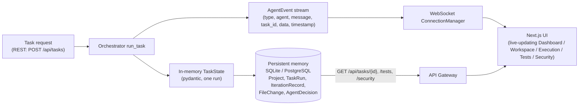

# AURA Architecture

This document describes the actual module layout of AURA as implemented under
`backend/app/` and `frontend/`, the autonomous execution loop the
Orchestrator drives, and how the pieces talk to each other. Every component
described here corresponds to a real module in the codebase — nothing in
this document describes aspirational or unimplemented behavior (see the
Roadmap in [README.md](README.md) for what's intentionally out of scope
today).

## 1. System architecture

Notes on the diagram:

- `Planner` and `Debugger` reason via the LLM and mostly do not need the Tool
  System directly (dotted edges); `RepositoryAnalyst`, `Coder`, `Tester`, and
  `Security` walk the filesystem, apply edits, and run commands through it.
- The **Tool System** is the only sanctioned way an agent touches the
  filesystem or a shell — there is no raw `eval`/`exec` path for agent
  output. File tools are bound to a sandbox root and reject path escapes;
  command/test tools execute through the **Sandbox Manager**.
- The **Sandbox Manager** runs commands in a real Docker container when a
  daemon is reachable, and transparently falls back to a reduced-isolation
  local-subprocess mode otherwise (see §4 and `SECURITY.md`).

## 2. Component descriptions

- **API Gateway (`app/api/`, `app/main.py`)** — FastAPI app exposing REST
  endpoints for tasks, providers, tests, security reports, and metrics, plus
  a `/ws/tasks/{id}` WebSocket for live agent event streaming. See
  [docs/api.md](docs/api.md) for the full endpoint reference.
- **Orchestrator (`app/orchestrator/`)** — Owns `TaskState` and drives the
  autonomous loop: plan → analyze → (implement → test → debug/fix)\* →
  security → verify → commit → report. Bounded by `max_iterations` (default
  5, configurable via `MAX_ITERATIONS`) — there is no infinite retry.
- **LLM abstraction (`app/llm/`)** — A single `LLMProvider` interface with
  concrete implementations for OpenAI, Anthropic, Gemini, and Ollama, plus a
  deterministic, offline `MockProvider`. `app/llm/factory.py` selects a
  provider by name and transparently falls back to `MockProvider` if the
  requested provider isn't configured (missing key) — this is what keeps
  tests, CI, and demo mode runnable with zero API keys.
- **Agents (`app/agents/`)**:
  - `PlannerAgent` — turns a natural-language goal into a `PlanResult`.
  - `RepositoryAnalystAgent` — walks the repository to build a `RepoMap`
    (languages, frameworks, dependencies, test files, git presence) computed
    from real filesystem facts, optionally topped with an LLM-generated
    summary string.
  - `CoderAgent` — asks the LLM for a structured list of edits and applies
    them through the Tool System (`write_file` / `edit_file`), never by
    overwriting the repo wholesale.
  - `TesterAgent` — runs the project's test suite via the `run_tests` tool
    and returns a `TestReport`.
  - `DebuggerAgent` — given a failing `TestReport`, proposes a `DebugReport`
    (root cause, affected files, proposed fix, confidence).
  - `SecurityAgent` — deterministic regex-based static analysis (no LLM
    call) producing a `SecurityReport`.
- **Tool System (`app/tools/`)** — `Tool` base class + `ToolRegistry`. Every
  invocation is logged (agent, tool, target path, status, duration). File
  tools resolve every path against a bound root and reject traversal.
- **Sandbox (`app/sandbox/`)** — `SandboxManager`, described in §4.
- **Git integration (`app/git_integration/`)** — `GitManager`, a thin
  GitPython wrapper for status/diff/log/commit, used both by the Tool
  System and directly by the Orchestrator's commit step.
- **Memory (`app/memory/`)** — SQLAlchemy 2.0 models (`Project`, `TaskRun`,
  `IterationRecordModel`, `FileChangeModel`, `AgentDecisionModel`) — the
  durable record of what a task run did, independent of the in-process
  Pydantic `TaskState`.
- **WebSocket (`app/websocket/`)** — `AgentEvent` schema and
  `ConnectionManager`, which fans out structured events to every socket
  subscribed to a task (or globally). Agents never stream raw
  chain-of-thought — only concise, structured event summaries.
- **Observability (`app/observability/`)** — structured event logging today;
  Prometheus metrics gated behind `METRICS_ENABLED`.

## 3. Agent interaction for one task run

## 4. Execution / autonomous loop

The `max_iterations` bound (default `5`, set via `MAX_ITERATIONS`) is a hard
cap enforced in code, not a soft heuristic — the loop always terminates.
Security scanning and report finalization run unconditionally, even for a
task that never got its tests passing, so every task run produces a complete
`TaskState` for the UI and memory store.

## 5. Sandbox architecture

`SandboxManager.mode` is a public attribute specifically so callers (and the
UI, and this documentation) can surface which mode is actually active — see
[docs/sandbox.md](docs/sandbox.md) and `SECURITY.md` for the full honesty
statement about what the fallback mode does and does not guarantee.

## 6. Data flow

Structured events flow to the UI in real time over WebSocket as the
Orchestrator progresses; the same task's durable summary (status, iteration
count, test/security outcomes) is persisted to the memory store so the REST
endpoints can serve it after the fact, including after a backend restart.
