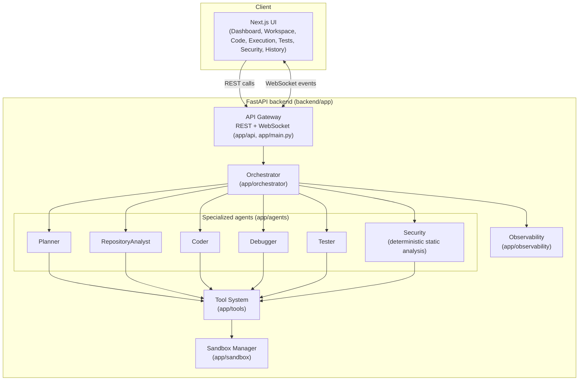

# AURA — Autonomous Unified Reasoning & Engineering Agent

*An autonomous AI software engineering platform that plans, codes, executes, debugs, tests, and verifies software inside secure sandboxes.*

[](backend/requirements.txt)
[](frontend/package.json)
[](docker-compose.yml)
[](.github/workflows/ci.yml)
[](LICENSE)
[](backend/tests)

## Overview

AURA is an autonomous software engineering agent platform: given a
natural-language goal and a target repository, it plans an approach,
analyzes the codebase, writes code, runs it in an isolated sandbox, tests
it, debugs failures, statically scans for security issues, and — if
everything checks out — commits the result. It streams every step to a
live dashboard as structured events, not raw model chain-of-thought.

It's built to be inspected, not taken on faith: the LLM layer is
provider-agnostic (OpenAI, Anthropic, Gemini, Ollama) with a deterministic,
offline `MockProvider` so the whole system — tests, CI, and a full demo
run — works with zero API keys. Everything the agents do goes through a
logged, root-bound Tool System, never raw filesystem or shell access.

## Why this exists

This project was built as a research-caliber portfolio piece — the kind of
system-design and engineering-rigor exercise relevant to a software
engineering internship or graduate research application. It's meant to
demonstrate real distributed-systems and agent-architecture thinking:
provider abstraction, a bounded autonomous control loop, sandbox isolation
with an honestly-documented fallback mode, structured observability, and a
benchmark designed to be *validated*, not just asserted. It is a real,
runnable codebase, not a mockup — and it says so plainly wherever a
capability isn't finished yet, rather than overselling it.

## Features

- **Provider-agnostic LLM layer** (`backend/app/llm/`) — OpenAI, Anthropic,
  Gemini, and Ollama behind one interface, plus a deterministic offline
  `MockProvider` used by tests, CI, and the demo so nothing requires API
  keys to run.
- **Tool system** (`backend/app/tools/`) — `read_file`, `write_file`,
  `edit_file`, `list_directory`, `search_code`, `run_command`,
  `run_tests`, `git_status`, `git_diff`, `git_log`, `git_commit`. Every
  call is logged; file tools are path-traversal protected against a bound
  root.
- **Six specialized agents** (`backend/app/agents/`) — Planner,
  RepositoryAnalyst, Coder, Debugger, Tester, and Security (a deterministic
  static-analysis rule engine, not an LLM call).
- **Orchestrator** (`backend/app/orchestrator/`) — drives the autonomous
  loop plan → analyze → implement → test → (debug → fix → retest)\* →
  security → verify → commit, hard-bounded by `max_iterations` (default
  5, configurable).
- **Sandbox manager** (`backend/app/sandbox/`) — real Docker container
  isolation (CPU/memory limits, network disabled, timeout) when a Docker
  daemon is available, with a transparent, honestly-labeled
  reduced-isolation local-subprocess fallback when it isn't.
- **Git integration** (`backend/app/git_integration/`) — status/diff/log/
  commit via GitPython.
- **Persistent memory** (`backend/app/memory/`) — SQLAlchemy models,
  SQLite for local dev/tests, PostgreSQL in `docker-compose.yml`.
- **Real-time WebSocket event streaming** (`backend/app/websocket/`) of
  structured agent events — never raw chain-of-thought.
- **REST + WebSocket API** (`backend/app/api/`, `backend/app/main.py`) —
  tasks, providers, tests, security, metrics.
- **AURA-Bench** (`aura-bench/`) — 20 small, real, independently-runnable
  software engineering micro-tasks with a `--validate` mode that actually
  runs starter (must fail) and solution (must pass) against each task's
  pytest harness and writes the results to a JSON file.
- **Offline demo mode** (`demo/`, `scripts/run_demo.sh`) — a deliberately
  broken sample project driven through analyze → test (fail) → fix → test
  (pass) → report, reproducible with zero API keys.
- **Next.js dashboard** (`frontend/`) — Dashboard, Agent Workspace, Code
  (Monaco viewer), Execution, Tests, Security, and History pages, with live
  WebSocket updates and a clearly-labeled fallback to sample data if the
  backend isn't reachable.

## Architecture



See [ARCHITECTURE.md](ARCHITECTURE.md) for the full component breakdown and
four more diagrams (agent interaction sequence, the execution loop, sandbox
architecture, and data flow).

## Quick Start

### Backend

```bash
cd backend
python3 -m venv .venv
source .venv/bin/activate
pip install -r requirements.txt
uvicorn app.main:app --reload
```

This uses the default local sqlite database and no external services --
nothing else to install. If you're pointing AURA at a real PostgreSQL
database instead (see `docker-compose.yml`), also run
`pip install -r requirements-postgres.txt`.

### Frontend

```bash
cd frontend
npm install
npm run dev
```

### Or, everything via Docker

```bash
docker compose up
```

Full walkthrough: [docs/getting-started.md](docs/getting-started.md).

## Configuration

All configuration is environment-variable driven — see
[.env.example](.env.example) for every variable (LLM providers, database,
sandbox limits, orchestrator iteration cap, security thresholds,
observability). Copy it to `.env` and fill in only what you need; AURA runs
with zero LLM keys via the deterministic `MockProvider`.

## Demo

```bash
bash scripts/run_demo.sh
```

Runs AURA against a small deliberately-broken sample project entirely
offline: analyze → test (fail) → fix → test (pass) → report. No API keys
required. See [docs/getting-started.md](docs/getting-started.md) for
driving the same repository through the live backend once an LLM key is
configured.

## Benchmark

```bash
python3 aura-bench/runner/runner.py --validate
```

Actually runs, for every one of AURA-Bench's 20 tasks, the starter code
(must fail) and the reference solution (must pass) against that task's
pytest harness, and writes the result to `aura-bench/results/`. See
[docs/evaluation.md](docs/evaluation.md) for the full methodology and this
project's policy on only citing numbers that came from a real run.

## Security

See [SECURITY.md](SECURITY.md) for the full threat model. In short: no
secrets are ever committed (`.env` is gitignored, only `.env.example` is
tracked); agents only touch the filesystem/shell through a logged,
path-traversal-protected Tool System; command execution runs through a
Sandbox Manager that uses **real Docker container isolation** when a
daemon is reachable, and otherwise **transparently falls back to a
reduced-isolation local-subprocess mode** — that fallback is best-effort
only and is not recommended for untrusted code; a deterministic
`SecurityAgent` static-analysis pass runs on every task (heuristic linter,
not a guarantee); and dependency vulnerability scanning is not yet
implemented (see Roadmap).

## Project Structure

```
aura-autonomous-engineering-agent/
├── backend/
│   ├── app/
│   │   ├── agents/            # Planner, RepositoryAnalyst, Coder, Debugger, Tester, Security
│   │   ├── api/                # REST routes
│   │   ├── git_integration/    # GitManager (GitPython wrapper)
│   │   ├── llm/                 # Provider-agnostic LLM abstraction + providers
│   │   ├── memory/              # SQLAlchemy models + DB session
│   │   ├── observability/       # Structured logging / metrics
│   │   ├── orchestrator/        # Orchestrator + TaskState schemas
│   │   ├── sandbox/             # SandboxManager (Docker + local-subprocess fallback)
│   │   ├── tools/                # Tool base/registry + file/command/git tools
│   │   ├── websocket/            # AgentEvent schema + ConnectionManager
│   │   ├── config.py
│   │   └── main.py
│   ├── tests/
│   └── requirements.txt
├── frontend/                    # Next.js + TypeScript + Tailwind dashboard
├── aura-bench/
│   ├── tasks/                    # 20 micro-task directories (starter/solution/tests)
│   ├── runner/                   # Benchmark runner + --validate mode
│   └── results/                  # Reproducible validation/run output (tracked)
├── demo/
│   └── broken_project/           # Deliberately-broken sample project for the offline demo
├── scripts/
│   └── run_demo.sh
├── docs/                          # Deep-dive docs (getting started, architecture, agents,
│                                    # sandbox, evaluation, API, development, research)
├── docker/                        # Dockerfile.backend, Dockerfile.frontend, prometheus.yml
├── .github/workflows/ci.yml
├── docker-compose.yml
├── ARCHITECTURE.md
├── SECURITY.md
├── CONTRIBUTING.md
└── README.md
```

## Roadmap

- [x] Provider-agnostic LLM abstraction with a deterministic offline mock
- [x] Logged, path-traversal-protected tool system
- [x] Six specialized agents (Planner, RepositoryAnalyst, Coder, Debugger,
      Tester, Security)
- [x] Bounded autonomous orchestrator loop
- [x] Docker sandbox with honest local-subprocess fallback
- [x] Git integration (status/diff/log/commit)
- [x] Persistent memory (SQLite / PostgreSQL)
- [x] Real-time WebSocket event streaming
- [x] REST + WebSocket API
- [x] AURA-Bench: 20 validated micro-tasks + `--validate` harness proof
- [x] Offline, zero-key demo mode
- [x] Next.js dashboard with live updates and sample-data fallback
- [ ] Model comparison / benchmark dashboard
- [ ] Prometheus/Grafana observability stack wired end-to-end
- [ ] Distributed execution across multiple sandboxes/workers
- [ ] Cloud sandbox execution (beyond local Docker)
- [ ] Long-term engineering memory beyond the current SQLite/Postgres schema
- [ ] Large-scale (100+) task benchmark
- [ ] Dependency vulnerability scanning

## Research Direction

AURA-Bench exists to generate real, reproducible evidence about how
autonomous coding agents behave — not just to run a demo. Open questions
this project is designed to help answer empirically (iterative vs.
single-shot execution, multi-agent vs. single-agent, the effect of
automated testing and sandboxing on reliability and safety, per-subtask
model comparison, optimal iteration counts, and regression reduction) are
laid out, explicitly unanswered, in [docs/research.md](docs/research.md).

## License

MIT — see [LICENSE](LICENSE).

## Screenshots

Run the frontend locally (see Quick Start) to see the live UI — screenshots
will be added after the first deployed run.
